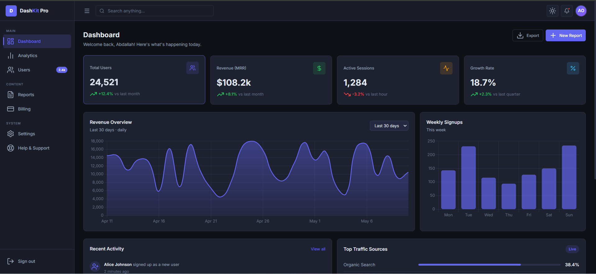

# DashKit Pro — SaaS Admin Dashboard Template



> A beautiful, ready-to-use admin dashboard starter
> kit for developers. Skip weeks of boring setup and
> start building your actual product immediately.

## 🚀 Live Demo
[[View Demo](https://abood170.github.io/dashkit-pro/)](https://abood170.github.io/dashkit-pro/)

## 📦 Pages Included

| Page | Description |
|------|-------------|
| 🔐 Login | Clean auth form with social login |
| 📝 Signup | Registration with validation |
| 📊 Dashboard | KPI cards + revenue charts |
| 📈 Analytics | Traffic & growth charts |
| 👥 Users | Searchable, sortable table |
| 📋 Reports | Report management system |
| 💳 Billing | Plans & invoice history |
| ⚙️ Settings | Profile, password, appearance |

## ✨ Features

- 🌙 Dark & light mode toggle
- 📱 Fully responsive (mobile, tablet, desktop)
- 📊 Interactive charts (Chart.js)
- 🔍 Search functionality
- 🎨 Easy to customize
- ⚡ No install needed — just open dashboard.html
- 🆓 Free updates forever

## 🛠 Tech Stack

- Pure HTML5
- CSS3 (custom properties)
- Vanilla JavaScript
- Chart.js (via CDN)
- Lucide Icons (via CDN)
- Google Fonts — Inter

## 🚀 Quick Start

1. Download or clone the repo
2. Open `pages/dashboard.html` in your browser
3. That's it! No install, no build tools needed.

```bash
git clone https://github.com/Abood170/dashkit-pro.git
cd dashkit-pro
open pages/dashboard.html
```

## 📁 File Structure

```
dashkit-pro/
├── index.html              # Landing page / redirect
├── README.md
├── LICENSE
├── preview.png
│
├── pages/
│   ├── login.html          # Authentication — login
│   ├── signup.html         # Authentication — register
│   ├── dashboard.html      # Main dashboard with KPIs
│   ├── analytics.html      # Traffic & growth charts
│   ├── users.html          # User management table
│   ├── reports.html        # Report management system
│   ├── billing.html        # Plans, usage & invoices
│   ├── settings.html       # Profile & app settings
│   └── 404.html            # Custom error page
│
├── css/
│   ├── style.css           # Core styles & design system
│   ├── dark.css            # Dark theme variables
│   └── light.css           # Light theme variables
│
└── js/
    ├── app.js              # Shared logic (theme, toasts, user)
    ├── sidebar.js          # Sidebar collapse & mobile drawer
    └── charts.js           # Chart.js chart definitions
```

## 🎨 Customization

**Change the brand color** — edit a single CSS variable in `css/style.css`:
```css
:root {
  --accent: #6366f1; /* swap to any color */
}
```

**Add a new page** — copy any existing page in `pages/`, update the sidebar `<a>` tags across all pages, and add your content.

**Swap chart data** — all chart definitions live in `js/charts.js`. Each chart is a plain Chart.js config object; replace the `data` arrays with your real API data.

## 📄 License

MIT — free for personal and commercial projects.

---

Built with care by [Abood170](https://github.com/Abood170)
